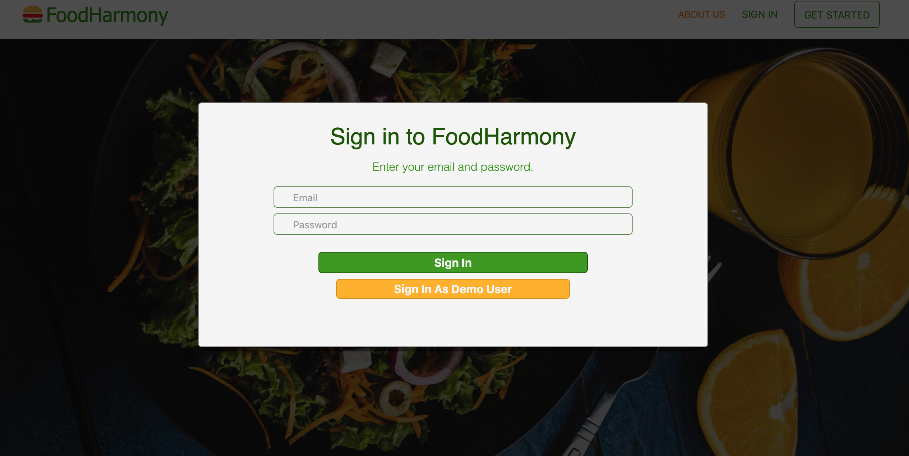
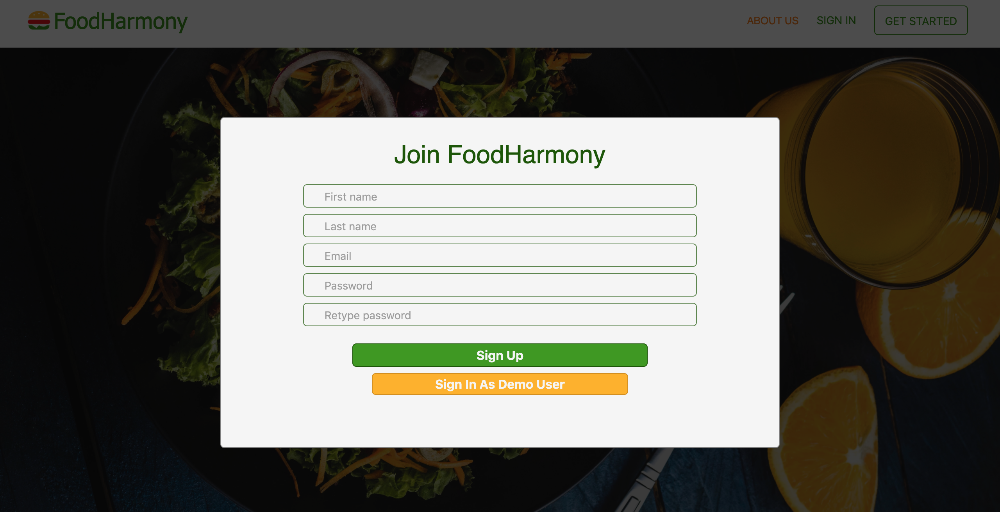
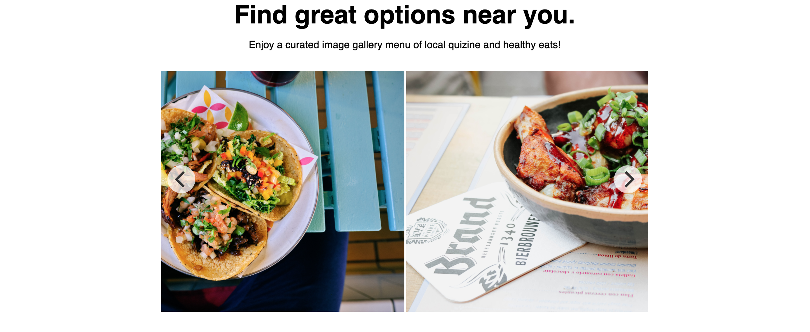

Welcome to the food_harmony wiki!

## Background and overview

Food Harmony is a single page app designed to simplify how you choose what to eat. The user is provided with a simple UI infinite scrolling feed of food images. No other information is given so the user, they will be making their decision based solely on how the food looks. If they see an image they like, they can click on it and the restaurant that makes that dish will be rendered on the screen with extra information and google maps with that restaurant pinged. Three of our main design choices revolve around ease of use, curation of data, and seamless user experience. Ease of use goes hand in hand with a simple but effective UI design and an organized and efficient backend. Curation of data revolves mainly around how we choose to display the information pulled from APIs to the user. And making a seamless experience from the user sign in to the infinite scroll and the restaurant show page.

## Functionality and MVP's

* User is greeted by a dynamic splash page showcasing delicious looking pictures and app
mission statements.


* User Authentication : A new user can create a new account, sign in to an existing account, and log out. Their account will persist to the database to be accessed again later.




* A carousel of food images is rendered on the splash page using the React Flickity component



* User Profile and associated data : A user will have a profile to display information about themselves as well as be able to look at a page of favorited images and restaurants.

* Active Storage (AWS) : format the infinite scroll and populate our index page with pictures stored in AWS

* Restaurants : Use API to pull pictures of food associated with restaurants. Storing restaurants in MongoDB and creating show pages for them. This will also provide an opportunity for us to begin populating our image feed with associated images instead of seed data. The images of food and Tags for those images will be stored under meal items associated with a specific restaurant. 

* Filters : Allows the user to further curate their data by limiting search by price range or food type.

## Technologies and Challenges

Food Harmony will be built using the popular MERN stack. This stands for MongoDB, Express, React, Node.js.

* MongoDB : A noSQL database structure that allows for easier expansion and quick read times. This app plays in to Mongo's strengths because a large amount of data will have to be initially stored but should be easy to handle spread across multiple databases. We also have a relatively simple architecture for our documents so there aren't many difficult associations we need to keep track of.

* Express : A router that allows us to control the flow of information between React and Mongo.

* React / Redux : The visual part of the app. React is great for building compartmentalized and organized web structures. We also use react to continuously update the UI without having to re-render the whole page which can save tons of time on loading. This is very useful for an image heavy app that exists mainly to transfer and curate data.

* Node : allows us to work in JavaScript on our local machines. Without node we would not be able to write our back end database and routes with javascript.

* React-Flickity-Component : this components allows us to dynamically display and flip through pictures saving space on our splash page and adding another dynamic element. It is 
simple enough to create but styling was the real challenge and took some effort.

```
const flickityOptions = {
	initialIndex: 3,
	freeScroll: true,
	wrapAround: true,
	autoPlay: 3000,
	contain: true
};

function Carousel() {
	return (
		<Flickity
			className={"carousel"}
			elementType="section"
			options={flickityOptions}
			disableImagesLoaded={false}
			reloadOnUpdate
			static
		>
			
			
			
			
			
			
			
		</Flickity>
	);
}

export default Carousel;
```

The main challenges facing us as a group is figuring out the best way to use the APIs we need and how to format that data as it comes in. 

## Group Members

* Harsha Venkatesh : MongoDB back-end team lead / git integration
* Nicholas Cheung : MongoDB back-end API specialist / routes
* James Berke : React front-end team lead / project manager / UI/UX
* Steve Cao : React front-end specialty features
